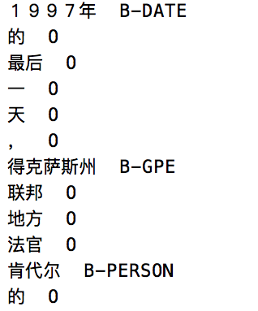
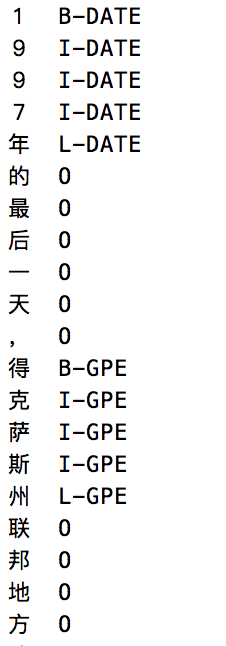

= 人民日报语料库处理工具集

包含人民日报语料相关的处理脚本。
输出的格式为 `CoNLL-U` 格式

== 处理流程
* 文件编码格式转换
* 解析并转化语料库

这里详细介绍一下 `解析并转化语料库` 这一部分

=== 解析语料库
因为原始的人民日报语料库格式存在嵌套语法等，导致其难以用规则的方法解析，这里使用了基于 `ply` 的 `lex + yacc` 的语法解析方案。

=== 转换语料库（仅应用于 NER 数据）
1. 1998语料库标注人名时，将姓和名分开标注，因此需要合并姓名，比如 `王/nrf  小明/nrg` 应该合并成 `王小明/nr`
2. 中括号括起来的几个词表示大粒度分词，表意能力更强，需要将括号内内容合并，比如 `[中央/n  人民/n  广播/vn  电台/n]nt` 应该合并成 `中央人民广播电台/nt`
3. 时间合并，例如将”1997年/t 3月/t” 合并成”1997年3月/t”
4. 全角字符统一转为半角字符，尤其是数字的表示，比如：`1９９８年/t` 应该转换成 `1998年/t`

== 使用
=== 预料下载
人民日报语料库是版权材料，本仓库不提供原始的人民日报语料库，但是用户登录官方网站后可以自行下载（任何人都可以注册）。

请访问 http://opendata.pku.edu.cn/dataset.xhtml?persistentId=doi:10.18170/DVN/SEYRX5[现代汉语多级加工语料库], 注册用户后方可下载语料库。
请下载 `5-199801基本标注语料库-2003年版规范-20170612.rar` ，解压缩后将文件 `1998-01-2003版-带音.txt` 放置到 `./data` 目录下。

=== 运行脚本

环境要求：python >= 3.5

==== 转换文件编码
原始文件采用的是 `gbk`，需要将其转换成 `utf-8` 编码

[source,shell]
----
python ./convert_encoding.py
----

==== 解析并转化语料库
将原始的语料库格式解析并转换成类似 `CoNLL-U` 格式

[source,shell]
----
python ./parse_data.py
----

运行结束后，将得到文件 `./data/xxx.conllu`

默认情况下，运行此文件将得到两个文件：`data_False-True-True-False-False-False-False.conllu` 和 `data_False-True-True-True-True-True-False.conllu`

文件名中的 True False 对应着选项 `merge_sub_token`、`remove_geta_symbol`、`extract_first_token_as_document_id`、`merge_family_name`、`merge_time`、`replace_double_byte_punctuation` 和 `output_doc_id` 的启用或者关闭。

`data_False-True-True-False-False-False-False.conllu` 是为了后续分词任务而准备的，它关闭了某些合并操作。

`data_False-True-True-True-True-True-False.conllu` 是为了后续 ENR 任务而准备的，它应用了某些合并操作。

== CoNLL-U 格式介绍
TODO @ http://universaldependencies.org/format.html

== 分割 train / dev / test
[source,shell]
----
python ./split_data.py
----

默认按照 train 90% / dev 0% / test 10% 做的分割，所得到的文件分别为 train.conllu dev.conllu test.conllu ，位于 `./data/split_data` 目录中。

== 命名实体识别
原始的人民日报语料库中不包含实体信息，但是有 POS 信息，根据人民日报语料库的标注标准，特定类别的名词被标记成了特殊的 POS, 因此可以利用这些信息来完成提取实体的工作。
根据1998语料库的词性标记说明，词性标记：`t`、`nr`、`ns` 和 `nt` 依次对应的实体是时间（DATE）、人名（PERSON）、地名（GPE）、组织机构名（ORG, organization）。

本项目的 NER 标记系统支持:

* `BILUO`，在 https://spacy.io/usage/linguistic-features#updating-biluo[The BILUO Scheme] 中详细的介绍了这个标记系统。
* `BIO`, 在 https://lingpipe-blog.com/2009/10/14/coding-chunkers-as-taggers-io-bio-bmewo-and-bmewo/[Coding Chunkers as Taggers: IO, BIO, BMEWO, and BMEWO+] 中详细的介绍了这个标记系统。

默认使用的 `BIO` 系统。

=== CRF++ 格式
CRF++ 系统所需的格式与 CoNLL-U 格式不太一致，需要经过转换。

==== 基于词（word)的 NER
[source,shell]
----
python ./conll_to_crfpp.py
----

所得到的文件位于 `./data/split_crfpp` 目录中。

所得文件样例如下：

==== 基于字（char)的 NER
[source,shell]
----
python ./conll_to_char_crfpp.py
----

所得到的文件位于 `./data/split_char_crfpp` 目录中。

所得文件样例如下：

== 中文分词
=== 空白分割格式
[source,shell]
----
python ./split_data_to_token.py
----

所得到的文件分别为 train.txt dev.txt test.txt ，位于 `./data/split_token` 目录中。

=== CRF++ 格式
[source,shell]
----
python ./split_token_to_token_conll.py
----

所得到的文件分别为 train.txt dev.txt test.txt ，位于 `./data/split_conll` 目录中。

== 致谢
`转换语料库` 部分参考了文章 https://zhuanlan.zhihu.com/p/27597790[达观数据如何打造一个中文NER系统] 的内容

== 参考文献

* https://zhuanlan.zhihu.com/p/27597790[达观数据如何打造一个中文NER系统]
* https://segmentfault.com/a/1190000006197218[使用Python转换全角字符串为半角]
* http://www.cnblogs.com/kaituorensheng/p/3554571.html[python实现全角半角的相互转换]